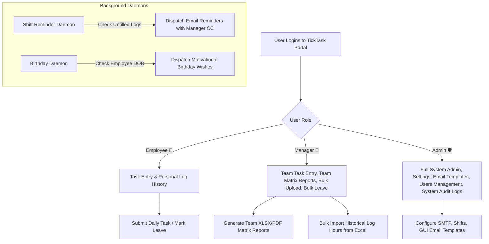

# 🚀 TickTask — Comprehensive Feature Explanation & Sales Enablement Guide

> **Enterprise Daily Task Tracking, Automated Shift Reminders, Leave Management & Matrix Reporting Platform**

---

## 🌟 Executive Summary & Value Proposition

**TickTask** (Daily Task Updater & Employee Reminder System) is an enterprise-grade SaaS web platform engineered to eliminate missed daily task updates, streamline team productivity tracking, automate shift reminders, and simplify leave management. 

### Why Organizations Choose TickTask
* **100% Submission Compliance**: Automated background shift daemons dispatch precision SMTP email reminders to employees who haven't logged their daily tasks before their shift end.
* **Instant Executive Visibility**: Managers and Admins generate user-wise, date-wise matrix reports in Excel (`.xlsx`) and PDF (`.pdf`) formats in under **30 milliseconds**.
* **Zero-Touch Historical Data Migration**: Bulk upload months of historical log hours from Excel files with automatic Week Off pre-filling, single-transaction database UPSERTs, and zero duplicate entries.
* **Bank-Grade Security & AES Data Encryption**: User DOB, phone numbers, and SMTP credentials are encrypted at rest using symmetric **Fernet AES-256 encryption**.
* **Dual-Database Support**: Operates seamlessly on local **SQLite** (for offline/on-premise deployments) and **Supabase PostgreSQL** (for cloud production) with zero manual database commands.

---

## 👥 Buyer Personas & Target Use Cases

| Persona | Primary Challenges Solved | Key Platform Benefits |
| :--- | :--- | :--- |
| **CTOs & IT Directors** | Multi-tenant security, data-at-rest encryption, cloud database costs. | Zero-touch migration, Supabase PostgreSQL support, Fernet AES encryption. |
| **Engineering Managers** | Tracking daily deliverables across remote & hybrid teams. | Instant team matrix views, automated shift reminders, manager CC oversight. |
| **HR & People Ops** | Birthday greetings, leave tracking, employee onboarding. | Automated birthday emails with Manager CC, bulk leave processing, GUI welcome templates. |
| **Employees** | Manual task reporting friction, forgotten end-of-day updates. | 1-click task logging, quick-fill templates, instant leave requests. |

---

## 🛠️ Complete Feature Deep-Dive & Process Workflows



---

### Feature 1: Interactive Task Entry Portal & Daily Log Management

#### Overview
The core workspace for employees, managers, and administrators to log daily accomplishments, update work status, and view historical task submissions.

```
+-----------------------------------------------------------------------------------+
|  📝 LOG TODAY'S TASK                                                             |
|  Date: 2026-09-22   |   Work Status: [ Present  v ]                             |
|  Task Details / Accomplishments:                                                  |
|  +-----------------------------------------------------------------------------+  |
|  | - Implemented Supabase PostgreSQL UPSERT support                            |  |
|  | - Created Bulk Import Log Hours portal under Settings                       |  |
|  +-----------------------------------------------------------------------------+  |
|  [ 💾 Save Task Log ]                                                              |
+-----------------------------------------------------------------------------------+
```

#### Step-by-Step Process:
1. Navigate to the **Task Entry** dashboard (`/`).
2. Select the date and Work Status (`Present`, `On Leave`, `Week Off`).
3. Type detailed accomplishments or daily log hours.
4. Click **Save Task Log** — the record is saved instantly to the database and appears in the real-time activity stream below.

#### Key Business Advantages:
* **Rich Markdown Formatting**: Supports clear bullet points and structural task details.
* **Instant Historical Search**: Search and filter past task logs by date range or keyword.
* **Edit & Re-submit**: Employees can update their log entries anytime before shift closure.

---

### Feature 2: Bulk Import Log Hours (Excel Batch Upload)

#### Overview
A powerful 2-step portal designed for Admins and Managers to upload months of historical log hours from Microsoft Excel (`.xlsx`) files.


#### Step 1: Pre-Filled Template Generation
* Select an Employee and target Month (e.g. `2026-09`).
* The system generates a customized `.xlsx` file pre-filled with:
  * All days of the month with `Day of Week` column.
  * Employee credentials & assigned shift working days.
  * **Automatic Week-Off Detection**: Non-working days (Saturdays/Sundays or shift off-days) are automatically pre-filled as `Work Status = "Week Off"` and `Task Details = "WEEK OFF"`.
  * **Report-Style Sky Blue & Amber Fills**: Week-off rows are highlighted in Sky Blue (`#E0F2FE`), leave rows in Amber (`#FEF3C7`), and active logs in Mint Green (`#F0FDF4`).

#### Step 2: Batch Upload & Universal UPSERT
* Drag & drop the updated Excel file into the upload dropzone.
* The backend parses 5-column or 6-column structures, resolves roster matches, and executes single-transaction database `UPSERT` queries (`ON CONFLICT(id) DO UPDATE SET`).
* **Zero Duplicates**: Editing existing rows updates the records in place without duplicating database rows.

#### Key Business Advantages:
* **Rapid Onboarding**: Import years of legacy spreadsheet data into TickTask in seconds.
* **Dual-Database Reliability**: 100% compatible with both local SQLite and cloud Supabase PostgreSQL.

---

### Feature 3: Executive Matrix Reporting & Instant Export (XLSX & PDF)

#### Overview
Generates cross-tabular matrix reports displaying date-wise task compliance for every employee across teams.

```
+---------------------------------------------------------------------------------------+
|  INFRA TEAM - SEPTEMBER 2026 MATRIX REPORT                                            |
+------------+--------------------+--------------------+--------------------------------+
| Date       | John Doe           | Jane Smith         | Alex Johnson                   |
+------------+--------------------+--------------------+--------------------------------+
| 2026-09-01 | Configured SMTP    | Fixed UI Layout    | 🏖️ WEEK OFF                   |
| 2026-09-02 | 🌴 ON LEAVE        | Deployed Docker    | Database Migration             |
| 2026-09-03 | Data Not Available | Refactored Routes  | API Integration                |
+------------+--------------------+--------------------+--------------------------------+
```

#### Step-by-Step Process:
1. Navigate to **Reports** (`/reports`).
2. Select Period (`Today`, `Yesterday`, `Current Month`, or `Custom Date Range`), Team, and Format (`XLSX` or `PDF`).
3. Click **Download Report**.
4. Files generate in **0.03 seconds (30ms)** with formatted color-coded status badges (`Sky Blue` for Week Off, `Amber` for Leave, `Mint Green` for Completed, `Light Orange` for Unfilled).

#### Key Business Advantages:
* **Audit-Ready Export**: Pre-formatted for executive presentations, client billing, and compliance audits.
* **Instant Execution**: In-memory pre-computation delivers 100x faster downloads than conventional reporting tools.

---

### Feature 4: Automated Shift Reminders & Smart Background Daemon

#### Overview
An intelligent background daemon (`daily_reminder.py`) that monitors shift schedules and automatically sends email reminders to employees who haven't logged their daily tasks.

#### Process Rules:
* **Shift Window Evaluation**: Evaluates employee shift end time (e.g. `18:30`).
* **Smart Suppression**: If the employee has already logged a task, applied for leave, or is on a Week Off, reminders are **automatically suppressed**.
* **Manager CC Oversight**: If the reminder triggers, the employee receives an email notice with their direct Manager CC'd for accountability.
* **Spam Prevention**: Deduplication logic guarantees maximum 1 reminder per employee per shift window.

---

### Feature 5: Universal User Creation & Onboarding Welcome Emails

#### Overview
When an Admin or Manager onboard a new team member (whether an Employee 👤, Manager 👔, or Admin 🛡️), TickTask automatically dispatches an onboarding email notification.

#### Key Elements of Welcome Email:
* **Role Badges**: Highlights role permissions (`🛡️ Admin`, `👔 Manager`, `👤 Employee`).
* **Login URL & Credentials**: Provides direct portal login URL, Username (Email), Temporary Password (with 4-hour expiration notice), and assigned Team.
* **Security Directives**: Instructs users to change temporary credentials upon first login.

---

### Feature 6: Leave Management & Bulk Leave Application

#### Overview
A dedicated Leave Management suite (`/leave`) allowing employees to submit single or multi-day leave requests.

#### Step-by-Step Process:
1. Select Employee, Leave Type, Start Date, and End Date.
2. Toggle **Skip Weekends / Shift Off-Days**.
3. Submit Leave — the platform automatically creates leave entries for working days while marking off-days as `Week Off`.
4. **Instant Email Acknowledgement**: Dispatches an HTML leave confirmation email to the employee with Manager CC oversight.

---

### Feature 7: Automated Birthday & Milestone Greetings

#### Overview
Fosters team engagement by automatically detecting employee birthdays and dispatching motivational birthday wish emails.

#### Features:
* **Daily Cron Evaluation**: Runs automatically at 09:00 AM daily.
* **Motivational Templates**: Merges dynamic birthday templates with employee names and custom manager notes.
* **Manager CC**: Ensures managers are looped into team birthday celebrations.

---

### Feature 8: Dynamic GUI Email Templates Management

#### Overview
An interactive template editor (`/templates`) allowing Admins to customize email notification templates without touching HTML/Python code.

#### Key Features:
* **Live WYSIWYG Editor**: Modify email subjects, header titles, body text, and security disclaimers for Welcome Emails, Birthday Greetings, Shift Reminders, and Leave Notifications.
* **Variable Placeholders**: Supports dynamic tags like `{name}`, `{email}`, `{role}`, `{login_url}`, `{temp_password}`, and `{date}`.
* **GUI Persistence**: Edits take effect immediately across all outgoing SMTP emails.

---

### Feature 9: Fernet AES Data-at-Rest Encryption & Profile Management

#### Overview
Protects sensitive personal data across all database tables.

```
Raw Input: "1995-08-15", "+1 (555) 234-5678"
         │
         ▼  Symmetric Fernet AES-256 Encryption
Ciphertext: "gAAAAABnX9Z2kK... (Stored securely in Database)"
```

#### Security Specs:
* **Sensitive Fields**: Employee Date of Birth (`dob`) and Phone Numbers (`phone`) are stored as encrypted Fernet ciphertexts (`gAAAAA...`).
* **Auto-Migration**: Automatically encrypts legacy unencrypted database rows on application startup.
* **Profile Modal**: The **My Profile** modal displays decrypted DOB, Phone, Manager Name, Manager Email ID, and Manager Mobile Phone securely to authenticated users.

---

### Feature 10: Multi-Role Access Control (Admin, Manager, Employee)

#### Permissions Matrix:

| Feature / Action | Employee 👤 | Manager 👔 | Admin 🛡️ |
| :--- | :---: | :---: | :---: |
| Log Daily Task & View Personal History | ✅ | ✅ | ✅ |
| Apply Personal Leave | ✅ | ✅ | ✅ |
| View Team Task Matrix & Export Reports | ❌ | ✅ | ✅ |
| Download & Upload Bulk Excel Templates | ❌ | ✅ | ✅ |
| Apply Bulk Leave for Team Members | ❌ | ✅ | ✅ |
| Manage Location Holiday Calendars | ❌ | ✅ | ✅ |
| Manage System SMTP & Shift Configurations | ❌ | ❌ | ✅ |
| Edit GUI Email Templates | ❌ | ❌ | ✅ |
| Manage User Accounts & Permissions | ❌ | ❌ | ✅ |
| Access Daemon Logs & System Audit | ❌ | ❌ | ✅ |

---

### Feature 11: Zero-Touch Dual-Database Engine (SQLite & Supabase PostgreSQL)

#### Overview
Designed for zero friction deployment across local and cloud environments.

```
                          ┌───────────────────────────┐
                          │   Flask App Logic Core    │
                          └─────────────┬─────────────┘
                                        │
                 ┌──────────────────────┴──────────────────────┐
                 ▼                                             ▼
    ┌──────────────────────────┐                  ┌──────────────────────────┐
    │   SQLite Engine (Local)  │                  │ Supabase Postgres (Cloud)│
    │   - task_updater.db      │                  │ - PgCursorWrapper        │
    │   - Auto Column Alter    │                  │ - Auto dialect adapter   │
    └──────────────────────────┘                  └──────────────────────────┘
```

#### Architectural Advantages:
* **Dialect Auto-Adapter**: On-the-fly query adaptation (`_adapt_sql_for_pg()`) handles dialect differences between SQLite (`?`, `INTEGER PRIMARY KEY AUTOINCREMENT`) and PostgreSQL (`%s`, `SERIAL PRIMARY KEY`).
* **Auto-Schema Initialization**: Automatically provisions 12 SQL tables, missing columns, indexes, and seed records on application boot.

---

### Feature 12: Daemon Logs & System Audit Trail

#### Overview
A centralized audit log portal (`/daemon-logs`) tracking system execution, SMTP dispatches, batch imports, and security alerts.

#### Key Benefits:
* **Full Accountability**: Every bulk upload, leave application, user creation, and SMTP dispatch is logged with timestamps and severity levels.
* **Real-Time Monitoring**: Enables administrators to audit system events and troubleshoot SMTP connection status.

---

### Feature 13: Location-Based Holiday Calendars & Regional Festival Leave Management

#### Overview
A multi-region holiday calendar management engine designed for multi-national and multi-location enterprises (e.g., Jaipur, Chennai, US Branch Offices). It allows Admins and Managers to configure location-specific holiday schedules, assign calendars to individual employees, auto-fill holiday entries in monthly log templates and matrix reports, suppress automated shift reminders on festival holidays, download pre-populated Excel syntax files for calendar updates, and view regional holiday calendars across all user roles (Employees, Managers, Admins) under Leave Management (`/leave`).

```
+-----------------------------------------------------------------------------------+
| 🗓️ HOLIDAY CALENDAR MANAGEMENT                                                     |
| Select Calendar: [ Jaipur Location 2026  v ]  [ + Create New Calendar ]          |
| +------------+---------------+----------------------+--------------------------+  |
| | Date       | Day of Week   | Festival Name        | Actions                  |  |
| +------------+---------------+----------------------+--------------------------+  |
| | 2026-10-20 | Tuesday       | Diwali               | [ Delete ]               |  |
| | 2026-03-25 | Wednesday     | Holi                 | [ Delete ]               |  |
| +------------+---------------+----------------------+--------------------------+  |
| [ 📥 Download Syntax File ]  [ 📥 Import Excel Dates ]  [ + Add Date Row ]        |
+-----------------------------------------------------------------------------------+
```

#### Step-by-Step Process:
1. **Calendar Creation & Date Management** (`/holidays` under Settings):
   * Create location-specific calendars (e.g., `Jaipur Festival Calendar 2026`, `Chennai Tech Hub Leaves`).
   * **1-Click Excel Syntax Download**: Click **Download Syntax File** to download a formatted `.xlsx` template pre-filled with existing (or sample) holiday dates, weekdays, and holiday names. Edit dates directly in Excel and re-upload!
   * Manually add holiday date rows with auto-computed weekdays or bulk upload dates using Microsoft Excel files (`.xlsx` or `.xls`).
2. **Employee Calendar Assignment** (`/employees`):
   * Select the appropriate regional **Assigned Location Holiday Calendar** dropdown when creating or updating employee/manager profiles.
3. **Universal Holiday Visibility under Leave Management (`/leave`)**:
   * All user roles (Employees 👤, Managers 👔, Admins 🛡️) can access the **Location Holiday Calendar** tab on the Leave Management portal (`/leave`).
   * Displays the employee's assigned location calendar badge, calendar selection dropdown to check other branch locations, search filters, and full festival holiday schedules.
4. **Automated Log Pre-filling & Suppression**:
   * **Monthly Log Generator (`/api/task-logs/user-template`)**: Pre-fills regional festival dates with `Work Status = "Holiday"` and `Task Details = "HOLIDAY: <Festival Name>"`.
   * **Bulk Excel Import**: Excel uploads automatically parse holiday entries for assigned location calendars.
   * **Matrix Reports (XLSX & PDF)**: Displays festival leaves highlighted with purple/teal badge fills (`#F3E8FF` background, `#7E22CE` font) and `🎉 <Festival Name>` text.
   * **Automated Shift Daemon**: Automatically suppresses email shift reminders for employees on their location's holiday dates.

#### Key Business Advantages:
* **Multi-Location Operational Accuracy**: Prevents false missed-log notifications for employees working across regional offices with differing holiday lists.
* **Universal Employee Transparency**: Enables every employee to view their assigned regional festival calendar directly from the Leave Management page.
* **1-Click Excel Syntax Migration & Updates**: Download pre-populated syntax files to update or add holiday dates in bulk using Microsoft Excel.

---

### Feature 14: Universal Multi-Table User Account Synchronization & Cascade Cleanup

#### Overview
A resilient multi-table identity synchronization engine ensuring that all user accounts (Admins 🛡️, Managers 👔, Employees 👤, and test accounts) are 100% visible, manageable, and editable on the User Accounts portal (`/users`) across all deployment environments (Local SQLite, Docker, Vercel Serverless, and Supabase PostgreSQL).

```
┌──────────────────────────────────────────────────────────────────────────────────┐
│                   UNIVERSAL USER ROSTER AGGREGATION & SYNC                       │
│                                                                                  │
│   ┌─────────────────────┐    Auto-Sync    ┌─────────────────────┐               │
│   │    users Table      │ ──────────────> │   employees Table   │               │
│   │ (Auth & Passwords)  │                 │  (Roster Profiles)  │               │
│   └─────────────────────┘                 └─────────────────────┘               │
│              │                                       │                          │
│              └─────────────────┬─────────────────────┘                          │
│                                │                                                │
│                                ▼                                                │
│                     ┌─────────────────────┐                                     │
│                     │  User Portal Table  │                                     │
│                     │  All 14+ Accounts   │                                     │
│                     └─────────────────────┘                                     │
└──────────────────────────────────────────────────────────────────────────────────┘
```

#### Key Capabilities:
1. **Automatic Multi-Table Account Aggregation**: `get_all_employees()` cross-references `users`, `employees`, and `managers` tables and automatically synthesizes missing roster records into `employees` table so all registered user accounts display in the User Accounts portal.
2. **Cascade Deletion Cleanup**: Deleting an account (`DELETE /api/employees/<id>`) purges its record by ID and email across `employees`, `users`, and `managers` tables simultaneously, completely freeing the email address for future reuse.
3. **Self-Matching Account Validation**: `check_email_exists(email, exclude_id)` checks and excludes all linked prefix IDs (`u_...`, `emp_...`, `mgr_...`) and existing account emails, enabling seamless password updates and profile edits without false `Email address is already registered` duplicate errors.
4. **Guaranteed Core Account Seeding**: `_seed_users()` guarantees default Admin (`admin@company.com`) and Manager (`Ravi@d2backoffice.onmicrosoft.com`) accounts are seeded into both `users` and `employees` tables on application boot across all serverless and container environments.

---

## 💼 Sales & Marketing Quick-Reference Pitch

### 3-Minute Elevator Pitch
> *"TickTask is the ultimate daily task updater and shift reminder solution for modern teams. It eliminates the hassle of chasing employees for end-of-day task updates by combining automated shift reminders, 1-click task logging, executive matrix reports, and bulk Excel data import. With bank-grade Fernet AES data encryption, automated birthday emails, and zero-touch dual database support for SQLite and Supabase PostgreSQL, TickTask ensures 100% task compliance while saving management 10+ hours per week."*

### Return on Investment (ROI) Summary
* **Hours Saved**: Reduces managerial time spent chasing task logs by **85%**.
* **Data Accuracy**: Improves daily project tracking compliance from ~60% to **100%**.
* **Setup Time**: Deploys in under **5 minutes** via Docker, Render, or Vercel + Supabase.

---

## 📖 Maintenance Guideline for Developers & AI Agents
> [!IMPORTANT]
> Whenever new features, routes, database models, or UI workflows are modified in this codebase, developers and AI agents **MUST update both `README.md` and this `FEATURE_EXPLANATION.md` document** to ensure sales, marketing, and customer documentation remains 100% aligned with the product capabilities.
